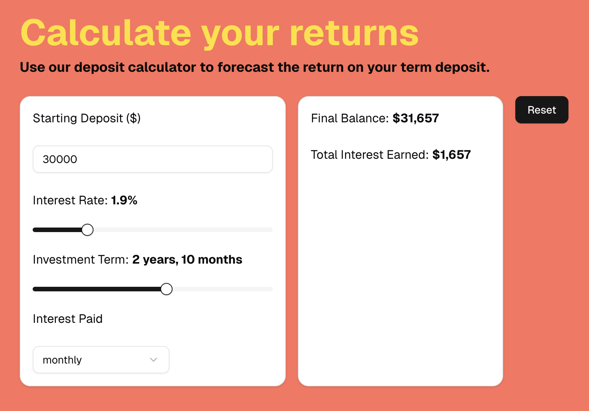

## Getting Started

1. Install NPM libraries:

```bash
npm install
```

2. Run the dev server:

```bash
npm run dev
```

3. Open [http://localhost:3000](http://localhost:3000) with your browser to see the result.

If you would like to run tests:

```bash
npm test
```

This is how the app looks when running:

